<!-- ✨ Commit pixel-dna.svg to the root of your mali8308/mali8308 repo for the banner below to show ✨ -->

  

<h1 align="center">👋🏻 Hey, I'm Ali!</h1>

  

  
  
  
  

---

> _The end goal is to end "end goals." Life doesn't have to be capped by biology — and honestly, it shouldn't be._ ♾️

By day (and, let's be honest, most nights) I'm a **Deployed Science Engineer at [Helical](https://www.helical-ai.com)** in London 🇬🇧, where I get to hand giant transformer models a cell's worth of RNA and ask them to hand me back a drug target. I went from running `RStudio` scripts at 2 a.m. chasing aging signals to interrogating 100M-parameter foundation models about what a diseased heart cell wishes it could forget. The mission never changed — just the size of the model. 🧬

---

### 🧬 What I'm building right now

- **Foundation models for drug discovery** — running, fine-tuning, and benchmarking `Geneformer`, `TranscriptFormer` & friends across indications and species.
- **In silico perturbation (ISP)** — perturbing genes *inside* the model to surface and rank therapeutic targets before anyone touches a pipette. *(Got known-target recovery in cardiomyopathy to **48% — 6× the DESeq2 baseline** on held-out data.)*
- **GRNs from attention** — turning transformer attention maps into gene regulatory networks + graph-theoretic mechanism deconvolution, so a "hit" comes with a story.
- **Cross-species target ID** — scaling discovery across ~20 species to figure out which model organism to trust, for which tissue, in which study.
- **Aging, still** — because at some level, every disease is just a cell forgetting how to be young.

---

### 🔬 Research interests

- 🤖 Foundation models & **mechanistic interpretability** for biology
- 🧫 Single-cell & **cross-species** transcriptomics
- 🧪 **In silico perturbation** / virtual-cell modeling
- ♾️ Computational genomics of **aging & longevity**
- 🕸️ Graph learning on biological networks

---

### 🧠 Tech & tools

**Languages & ML**  

**Single-cell & foundation models**  

**Infra & compute**  

🧾 …and the wet-lab / -omics fine print

 

**Assays I speak fluently:** bulk & single-cell RNA-seq, RNA velocity, ATAC-seq, ChIP-seq, DNA methylation, CITE-seq, spatial transcriptomics, immune-receptor profiling, variant calling, splicing analysis, GO / set-enrichment analysis.

**Modeling toolkit:** feature selection, regularization, cross-validation & bootstrapping, hyperparameter tuning, survival analysis, deep learning, predictive modeling.

**Wet-lab (from a previous life):** Yeast two-hybrid (Y2H), Gateway cloning, gel electrophoresis, bisulfite conversion, pyrosequencing, DNA extraction & quantification.

---

### 📜 Publications

- **Ali, M.**, Li, F., & Katari, M. S. (2025). *SkeletAge: Transcriptomics-based Aging Clock Identifies 26 New Targets in Skeletal Muscle Aging.* **bioRxiv.** [10.1101/2025.07.28.667277](https://doi.org/10.1101/2025.07.28.667277)
- Stokes, T., … **Ali, M.**, … Timmons, J. A. (2026). *A network-based atlas of human skeletal muscle aging.* **medRxiv.** [10.64898/2026.02.15.26346348](https://doi.org/10.64898/2026.02.15.26346348)
- Gao, J., … **Ali, M.**, … Li, F. (2026). *Dbp7 interacts with RNA exosome component Dis3 to mediate CENP-A loading to centromeres.* **Genome Biology** *(accepted).*

---

### 🏆 Achievements

- 🎓 **Fulbright Scholar** & **NYU GSAS Full-Tuition Scholarship**
- 💰 **NYU Biology Master's Research Grant** + **Wasserman Center Internship Grant**
- 🥇 **NUST Rector's Gold Medal** (Best Researcher) + 3× **High Achiever Scholarship**
- ♾️ Longevity fellowships: **TIME Initiative** (Cohort 2) & **LongX Xplore** (Cohort 1)

---

### 📊 By the numbers

  
  

  

  

---

### ⚡ Fun facts

- 🪂 I occasionally exit a perfectly good airplane at 10,000 ft. Highly non-convex optimization.
- 🐈‍⬛ My most ruthless code reviewer is a black cat — yes, the one squinting at you from the banner.
- 🧳 Recently migrated my own weights from 🇵🇰 Pakistan → 🇬🇧 London. Transfer learning, IRL.
- 🎬 Most people relax with a sitcom; I relax by finding a new dataset and seeing what it's hiding.

---

  <em>“Attention is all you need” — turns out that applies to genes too.</em> ✨

<!---
mali8308/mali8308 is a ✨ special ✨ repository because its `README.md` (this file) appears on your GitHub profile.
You can click the Preview link to take a look at your changes.
--->
